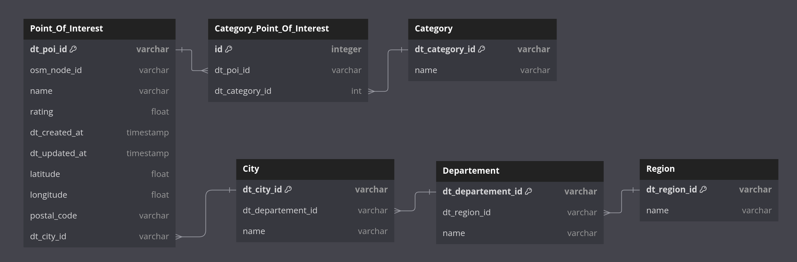

## Modélisation des données issues de Datatourisme

### 1 - UML / Diagramme de classe

Objectif : Modéliser les données issues de Datatourisme en appliquant une normalisation des données. (3NF)  
Ce modèle permet de clustériser les données en fonction de leur nature et de leur relation:
- Limitation du champ d'application 
  - à certains POI
  - certains type de POI
  - certaines villes
  - ...

Dans le but de limiter les calculs de distance / temps de traitement à postériori.



Ci-dessous le script DBML pour générer le diagramme de classe depuis dbdiagram.io

```
Table Point_Of_Interest {
  dt_poi_id varchar [primary key]
  osm_node_id varchar
  name varchar
  rating float
  dt_created_at timestamp
  dt_updated_at timestamp
  latitude float
  longitude float
  postal_code varchar
  dt_city_id varchar [Ref: > City.dt_city_id]

}

Table Category_Point_Of_Interest {
  id integer [primary key]
  dt_poi_id varchar [Ref: > Point_Of_Interest.dt_poi_id]
  dt_category_id int [Ref: > Category.dt_category_id]
}

Table Category {
  dt_category_id varchar [primary key]
  name varchar
}

Table City {
  dt_city_id varchar [primary key]
  dt_departement_id varchar [Ref: > Departement.dt_departement_id]
  name varchar
}

Table Region {
  dt_region_id varchar [primary key]
  name varchar
}

Table Departement {
  dt_departement_id varchar [primary key]
  dt_region_id varchar [Ref: > Region.dt_region_id]
  name varchar
}

```

## 2 - Création du schéma relationnel

```
-- Creation de la table Region
CREATE TABLE Region (
    dt_region_id VARCHAR(255) PRIMARY KEY,
    name VARCHAR(255) NOT NULL
);

-- Creation de la table Departement
CREATE TABLE Departement (
    dt_departement_id VARCHAR(255) PRIMARY KEY,
    dt_region_id VARCHAR(255),
    name VARCHAR(255) NOT NULL,
    FOREIGN KEY (dt_region_id) REFERENCES Region(dt_region_id)
);

-- Creation de la table City
CREATE TABLE City (
    dt_city_id VARCHAR(255) PRIMARY KEY,
    dt_departement_id VARCHAR(255),
    name VARCHAR(255) NOT NULL,
    FOREIGN KEY (dt_departement_id) REFERENCES Departement(dt_departement_id)
);

-- Creation de la table Point_Of_Interest
CREATE TABLE Point_Of_Interest (
    dt_poi_id VARCHAR(255) PRIMARY KEY,
    osm_node_id VARCHAR(255),
    name VARCHAR(255) NOT NULL,
    rating FLOAT,
    dt_created_at TIMESTAMP,
    dt_updated_at TIMESTAMP,
    latitude FLOAT,
    longitude FLOAT,
    postal_code VARCHAR(20),
    dt_city_id VARCHAR(255),
    FOREIGN KEY (dt_city_id) REFERENCES City(dt_city_id)
);

-- Creation de la table Category
CREATE TABLE Category (
    dt_category_id INT PRIMARY KEY,
    name VARCHAR(255) NOT NULL
);

-- Creation de la table Category_Point_Of_Interest
CREATE TABLE Category_Point_Of_Interest (
    id SERIAL PRIMARY KEY,
    dt_poi_id VARCHAR(255),
    dt_category_id INT,
    FOREIGN KEY (dt_poi_id) REFERENCES Point_Of_Interest(dt_poi_id),
    FOREIGN KEY (dt_category_id) REFERENCES Category(dt_category_id)
);
