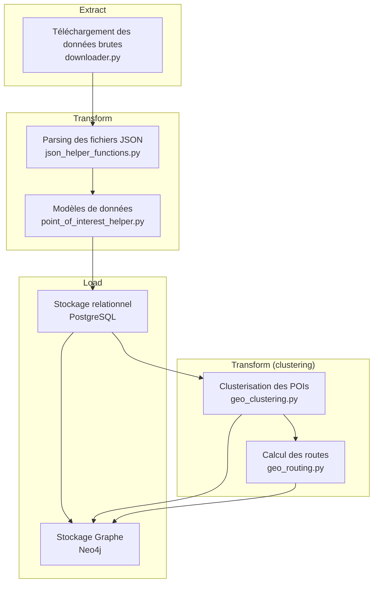
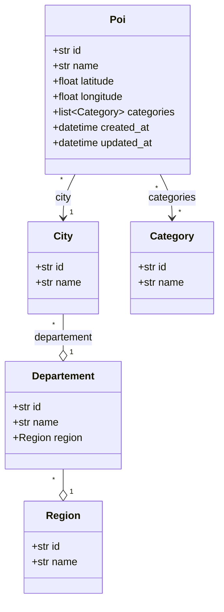
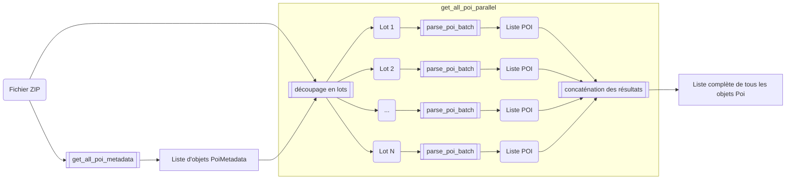
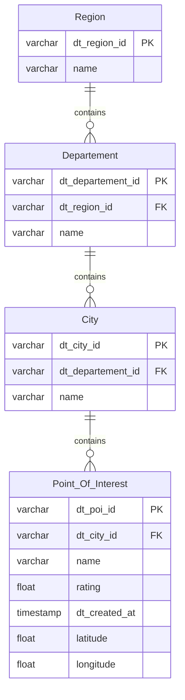
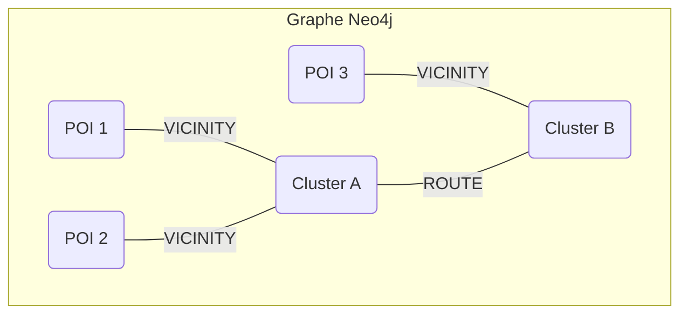

# Utilitaires

Le dossier `utils` contient un ensemble de modules, testés unitairement, qui fournissent les fonctionnalités de base pour la collecte, le traitement, le stockage et l'analyse des données de points d'intérêt (POI).

## Table des matières
- [Flux de Données Global](#flux-de-données-global)
- Sources de données
  - [`downloader.py`](#downloaderpy)
- Modélisation
  - [`point_of_interest_helper.py`](#point_of_interest_helperpy)
  - [`json_helper_functions.py`](#json_helper_functionspy)
- Stockage
  - [`database_create.sql`](#database_createsql)
  - [`database_helper.py`](#database_helperpy)
  - [`neo4j_helper.py`](#neo4j_helperpy)
  - [`temporary_objects.py`](#temporary_objectspy)
- Analyse spatiale
  - [`geo_clustering.py`](#geo_clusteringpy)
  - [`geo_routing.py`](#geo_routingpy)

## Flux de Données Global

Le schéma ci-dessous illustre comment les divers modules s'insèrent dans le flux de traitement des données, depuis le téléchargement jusqu'à l'exposition via les bases de données.

## `downloader.py`

Ce module est responsable du téléchargement des données nécessaires depuis des sources externes.

### Fonctions principales
*   `download_datatourisme_archive`: Télécharge et extrait l'archive des flux de données de DataTourisme.
*   `download_datatourisme_categories`: Récupère le fichier des catégories de DataTourisme.
*   `download_and_get_shapefile`: Télécharge un fichier Shapefile contenant les frontières de la France. Il sera utilisé pour filtrer les POIs aux coordonnées fantaisistes.
*   `cleanup_downloaded_data`: Nettoie les fichiers téléchargés après traitement.

---

### `point_of_interest_helper.py`

Ce module définit les classes qui structurent l'information des points d'intérêt et leurs métadonnées géographiques.

### Classes
*   `Region`, `Departement`, `City`: Structures hiérarchiques pour la localisation administrative.
*   `Category`: Représente une catégorie de POI.
*   `Poi`: Classe centrale représentant un point d'intérêt avec tous ses attributs (nom, coordonnées, catégories, etc.).

Le diagramme de classes ci-dessous montre les relations entre ces objets.

## `json_helper_functions.py`

Ce module contient des fonctions utilitaires pour extraire des informations spécifiques à partir des fichiers JSON de DataTourisme. Il sert de couche de "parsing" pour transformer les données brutes en objets structurés définis dans `point_of_interest_helper.py`.

### Fonctions
* `get_all_poi_metadata`: Lit le _fichier d'index_ qui répertorie tous les POIs d'une archive et retoune une liste d'identifiants de POIs. C'est le point de départ de la transformation des données DataTourisme.
* `get_all_poi_parallel`: Découpe en lots une liste de POIs et parse en parallèle chacun des lots à partir d'une archive zip en appelant `parse_poi_batch` pour chaque lot.
* `parse_poi_batch`: Charge et parse tous les JSON d'une liste de POIs en utilisant `parse_poi_from_json` pour chacun d'entre eux.
* `parse_poi_from_json`: Prend un contenu JSON DataTourisme et le transforme en un objet `Poi` complet.
* `get_poi_*`: Une série de fonctions pour extraire des champs spécifiques (identifiant, nom, coordonnées, etc.)

### Tests
*   `tests_json_helper_functions.py`: Vérifie que les fonctions de parsing extraient correctement les informations d'un fichier JSON d'exemple. Il teste chaque champ individuellement (nom, coordonnées, date, etc.) et la construction de l'objet `Poi` complet.

### Diagramme de Flux

Le diagramme ci-dessous illustre comment ces fonctions collaborent pour traiter les données en parallèle.

## `database_create.sql`

Script SQL pour créer la structure de la base de données PostgreSQL. Il définit les tables pour stocker les régions, départements, villes et points d'intérêt, ainsi que leurs relations.

## `database_helper.py`

Ce module gère toutes les interactions avec la base de données PostgreSQL. Il contient des fonctions pour se connecter à la base, y insérer des données collectées depuis les objets POI, et les lire.

### Fonctions principales
*   `connect_to_db`: Établit une connexion à la base de données.
*   `add_poi_to_db`, `update_poi_in_db`: Fonctions pour insérer ou mettre à jour des POIs dans la base de données.
*   `get_all_pois_from_db`, `select_pois_from_db`: Fonctions pour requêter les POIs stockés.
*   `process_batch`: Traite un lot de fichiers POI et les insère dans la base.

### Tests
*   `tests_database_helper_load.py`: Teste la connexion à une base de données de test (lancée via testcontainers), l'insertion et la lecture de POIs.

## `geo_clustering.py`

Ce module est utilisé pour regrouper des POIs géographiquement proches en "clusters". Il utilise l'algorithme HDBSCAN pour effectuer cette tâche.

### Classe `GeoClustering`
*   `__init__(pois)`: Initialise avec un DataFrame de POIs. Les coordonnées (latitude, longitude) sont converties en projection Lambert pour des calculs de distance métrique.
*   `create_clusters`: Applique l'algorithme HDBSCAN pour identifier les clusters de POIs.
*   `increase_clusters`: Tente d'assigner des POIs non clusterisés à des clusters existants s'ils sont suffisamment proches.
*   `transform_unclustered_into_clusters`: Traite chaque POI non clusterisé comme un cluster individuel.

### Tests
*   `tests_geo_clustering.py`: Vérifie le bon fonctionnement du processus de clustering : le calcul des coordonnées projetées, la création des clusters, l'augmentation des clusters, et la gestion des points non clusterisés.

## `geo_routing.py`

Ce module calcule des itinéraires pour connecter les clusters de POIs. Il commence par créer un arbre couvrant minimal pour garantir que tous les clusters sont connectés, puis peut ajouter des "raccourcis" pour optimiser les trajets.

### Classe `GeoRouting`
*   `__init__(nodes)`: Initialise avec un DataFrame de nœuds (les clusters). Calcule une matrice de distance et génère un arbre couvrant minimal (Minimum Spanning Tree) pour connecter tous les nœuds.
*   `increase`: Ajoute des arêtes supplémentaires (raccourcis) au graphe si la distance directe entre deux nœuds est significativement plus courte que le chemin existant dans l'arbre.

### Tests
*   `tests_geo_routing.py`: S'assure que tous les nœuds sont bien connectés après l'initialisation, que toutes les routes ont une distance valide, et que la méthode `increase` ajoute de nouvelles routes comme attendu.

## `neo4j_helper.py`

Ce module fournit des fonctions pour importer les données (POIs, clusters, routes) dans une base de données de graphe Neo4j. Cela permet des requêtes complexes basées sur les relations entre les entités.

### Fonctions principales
*   `connect_to_neo4j`: Établit une connexion au serveur Neo4j.
*   `import_pois`: Importe des POIs en tant que nœuds dans Neo4j.
*   `import_clusters`: Crée des nœuds de type `Cluster` et les relie aux POIs qu'ils contiennent via une relation `VICINITY`.
*   `import_routes`: Crée des relations `ROUTE` entre les nœuds `Cluster` pour représenter les itinéraires calculés par `geo_routing.py`.

Le schéma du graphe dans Neo4j est le suivant :

### Tests
*   `tests_neo4j_helper.py`: Utilise une instance de test Neo4j (via testcontainers) pour vérifier que la connexion fonctionne et que les fonctions d'import de POIs, clusters et routes créent correctement les nœuds et les relations dans la base de données.

## `temporary_objects.py`

Ce module offre un mécanisme de cache simple basé sur Redis. Il permet de stocker temporairement des objets Python pour éviter de les recalculer.

### Fonctions principales
*   `object_store(key, obj, expiration_in_seconds)`: Stocke un objet Python dans Redis avec une clé et une durée d'expiration optionnelle. L'objet est sérialisé avec `pickle` puis compressé avec `gzip`.
*   `object_read(key)`: Lit et désérialise un objet depuis Redis à partir de sa clé.
*   `object_delete(key)`: Supprime un objet du cache Redis.

### Tests
*   `tests_temporary_objects.py`: Lance un conteneur Redis de test pour vérifier que les objets peuvent être stockés, lus, et supprimés. Il teste également la fonctionnalité d'expiration automatique.

